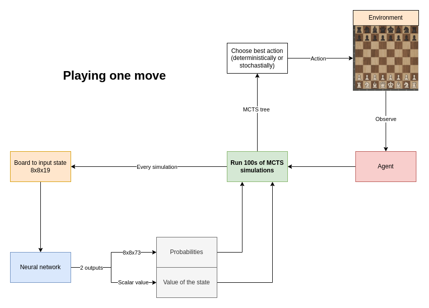
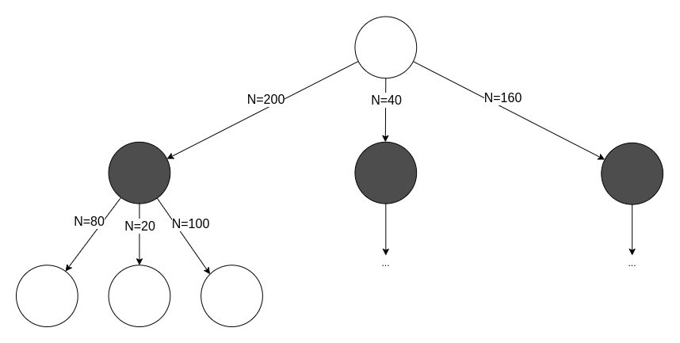
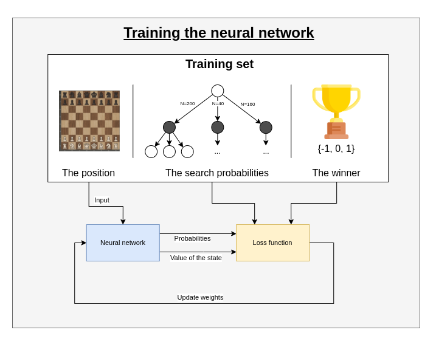

# chess-deep-rl-cpp
C++ version of my [chess-deep-rl](https://github.com/zjeffer/chess-deep-rl) project. WIP


## TODO

- [X] Create Neural Network
- [X] Implement MCTS algorithm
- [X] Training pipeline
- [X] Data loading into dataset
- [X] Continuously self-play games with specific model
- [X] Save self-play data on disk
- [ ] Fix training (loss doesn't drop, maybe loss calculation is wrong?)
- [X] Qt GUI for self-play
- [ ] Human vs computer (with GUI)
- [ ] Multithreaded MCTS
- [X] Parallel self-play
- [ ] Parallel self-play over network (one server with GPU, multiple clients that send inputs to the server)
- [ ] Kubernetes cluster of server & self-play clients

### How do normal chess engines work?

Contemporary chess engines use the minimax algorithm: for a given position, the engine tries to find the best move by creating a tree of all possible moves to a certain depth, and cutting down paths that lead to bad positions (alpha-beta pruning). It evaluates a position based on a pre-written evaluation function with the pieces as input. One player tries to maximize their score, and the other tries to minimize it.


> Image source: By Jez9999, CC BY-SA 3.0, https://commons.wikimedia.org/w/index.php?curid=3708424

### How does this chess engine work?

This chess engine is based on AlphaZero by Deepmind. It uses a neural network to predict the next best move. The neural network learns by playing against itself for a high amount of games, and using their results to train the network. The newly trained neural network is evaluated against the old network by playing many games against each other, and the best network is kept. This process is repeated for a long time.



To play one move, an Agent sends the environment's current position to the MCTS class to run hundreds of simulations of an adapted version of the MCTS algorithm. Every simulation, the input is fed to the neural network. Two outputs are returned: a tensor of probabilities representing the value of each possible move, and a value between -1 and 1 representing the value of the given input state.

After these simulations, the resulting MCTS tree is used to select the best move:



There are two ways to select these moves:

* The move with greatest $N$ (deterministically)
	* 200 in the above example
* According to a distribution (stochastically): $\pi \sim N$
	* 50% for action 1 (200/400)
	* 10% for action 2 (40/400)
	* 40% for action 3 (160/400)

### Creating a training set

* To train the network, you need a lot of data
* You create this data through self-play: letting the AI play against a copy of itself for many games.
* For every move, store:
	* The state
	* The search probabilities
	* The winner, (added once the game is over)

### Training the network

* Sample a mini-batch from a high amount of positions (see training set)
* Train the network on the mini-batch



## Usage

1) Clone the repository recursively: 

```bash	
git clone --recursive git@github.com:zjeffer/chess-deep-rl-cpp.git
```

2) Build and open the devcontainer using Visual Studio Code. You can also use this engine without a devcontainer, provided you install all dependencies:
	* `cmake make gcc gdb opencv git vtk hdf5 glew openmpi fmt sudo qt5-base qt6 ninja`
	* `g3log` (which can be found in vendor/)
	* All installation instructions can be found in .devcontainer/Dockerfile

3) It is necessary to run the following command on the host system to give the container access to the X11 display: `xhost +`
4) Build the executable with CMake
5) See a list of arguments: `./build/chess-rl --help`


A GUI is included to create chessgames through selfplay. Example of the GUI running self-play with 2 games in parallel:


In the GUI, you can:
	* select the model to use for self-play
	* choose the folder to save the games in
	* set the number of games to play in parallel
	* the amount of MCTS simulations to run every move.

[](https://hits.seeyoufarm.com)
