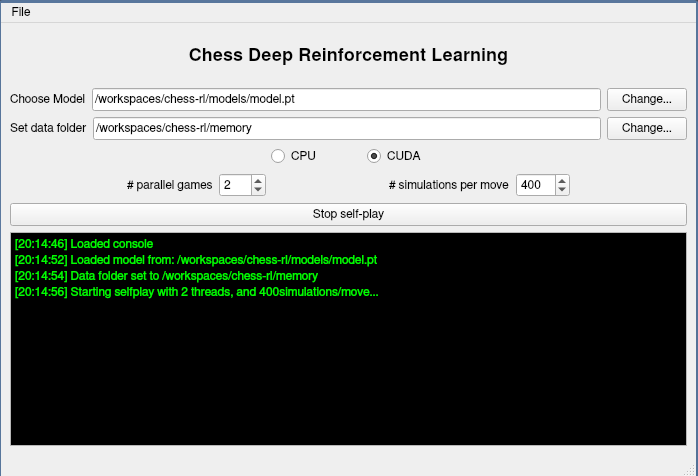

# chess-deep-rl-cpp
C++ version of my [chess-deep-rl](https://github.com/zjeffer/chess-deep-rl) project. WIP


## TODO

- [X] Create Neural Network
- [X] Implement MCTS algorithm
- [X] Training pipeline
- [X] Data loading into dataset
- [X] Continuously self-play games with specific model
- [X] Save self-play data on disk
- [ ] Fix training (loss doesn't drop, maybe loss calculation is wrong?)
- [X] Qt GUI for self-play
- [ ] Human vs computer (with GUI)
- [ ] Multithreaded MCTS
- [X] Parallel self-play
- [ ] Parallel self-play over network (one server with GPU, multiple clients that send inputs to the server)
- [ ] Kubernetes cluster of server & self-play clients

## Usage

1) Build and open the devcontainer. 

2) It is necessary to run the following command on the host system to give the container access to the X11 display:

```bash
xhost +
```

Example of the GUI running self-play with 2 games in parallel:


